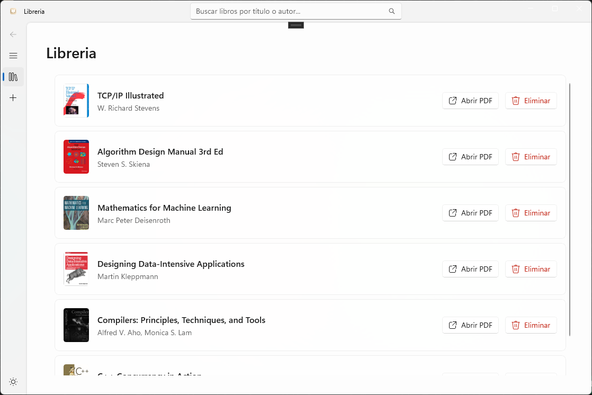
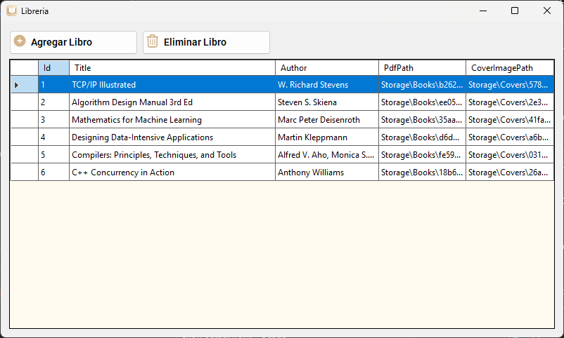

# BookLibrary

<p align="center">
  
</p>

<p align="center">
  
  
  
  
  
</p>

Aplicación de escritorio para gestionar una pequeña biblioteca de libros local. Incluye una versión con WinUI 3 y otra con Windows Forms. Utiliza Entity Framework Core para la gestión de datos con una base de datos sqllocaldb.

Es simplemente un demo para mostrar la arquitectura de N-Capas.


# Cómo ejecutar el proyecto
- **Requisitos:** .NET 8 SDK instalado y Visual Studio 2022/2023 o superior con cargas de trabajo de desarrollo de escritorio para C#. También hace faltar tener Windows SDK instalado para ejecutar la versión de WinUI 3.
- **Abrir solución:** Abra `BookLibrary.slnx` en Visual Studio.
- **Proyectos:** Puede ejecutar `BookLibrary.UI` (WinUI) o `BookLibrary.UI.Forms` (WinForms) según prefieras.

# Comandos útiles
- Eliminar la base de datos local:
  ```bash
  dotnet ef database drop -p BookLibrary.DAL
  ```
- Crear migración:
  ```bash
  dotnet ef migrations add NombreMigracion -p BookLibrary.DAL
    ```


# Capturas de pantalla

WinUI 3:



Windows Forms:



**Estructura principal**
- **`BookLibrary.DAL`**: Contexto de la base de datos y migraciones.
- **`BookLibrary.BLL`**: Lógica de negocio y servicios.
- **`BookLibrary.Entities`**: Modelos de dominio (`Models/Book.cs`).
- **`BookLibrary`**: Proyecto principal con la UI WinUI (`App.xaml`, `MainWindow.xaml`).
- **`BookLibrary.UI.Forms`**: Versión en Windows Forms (para referencia).


**Licencia**
MIT License. Consulte el archivo `LICENSE` para más detalles.
